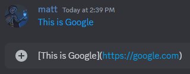

# Markdown Text 101

Want to inject some flavor into your everyday text chat? You're in luck! Discord uses Markdown, a simple plain text formatting system that'll help you **make your sentences stand out**. Here's how to do it! Just add a few characters before & after your desired text to change your text! I'll show you some examples...

**What this guide covers:**

- [Text Formatting](#text-formatting)
- [Organizational Text Formatting](#organizational-text-formatting)
  - [Headers](#headers)
  - [Subtext](#subtext)
  - [Masked Links](#masked-links)
  - [Unordered Lists](#unordered-lists)
  - [Ordered Lists](#ordered-lists)
- [Code Blocks](#code-blocks)
- [Block Quotes](#block-quotes)
- [Spoiler Tags](#spoiler-tags)
- [Syntax Highlighting](#syntax-highlighting)

## Text Formatting
<table style="height: 120px;">
<tbody>
<tr>
<td class="wysiwyg-text-align-left" style="width: 151px;"><em>Italics</em></td>
<td class="wysiwyg-text-align-left" style="width: 178px;">*italics* <strong>or</strong> _italics_</td>
</tr>
<tr>
<td class="wysiwyg-text-align-left" style="width: 151px;"><strong>Bold</strong></td>
<td class="wysiwyg-text-align-left" style="width: 178px;">**bold**</td>
</tr>
<tr>
<td class="wysiwyg-text-align-left" style="width: 151px;"><em><strong>Bold Italics</strong></em></td>
<td class="wysiwyg-text-align-left" style="width: 178px;">***bold italics***</td>
</tr>
<tr>
<td class="wysiwyg-text-align-left" style="width: 151px;">Underline</td>
<td class="wysiwyg-text-align-left" style="width: 178px;">__underline__</td>
</tr>
</tbody>
</table>
<table style="height: 120px;">
<tbody>
<tr>
<td class="wysiwyg-text-align-left" style="width: 153px;"><em>Underline italics</em></td>
<td class="wysiwyg-text-align-left" style="width: 191px;">__*underline italics*__</td>
</tr>
<tr>
<td class="wysiwyg-text-align-left" style="width: 153px;"><strong>Underline bold</strong></td>
<td class="wysiwyg-text-align-left" style="width: 191px;">__**underline bold**__</td>
</tr>
<tr>
<td class="wysiwyg-text-align-left" style="width: 153px;"><em><strong>underline bold italics</strong></em></td>
<td class="wysiwyg-text-align-left" style="width: 191px;">__***underline bold italics***__</td>
</tr>
<tr>
<td class="wysiwyg-text-align-left" style="width: 153px;"><s>Strikethrough</s></td>
<td class="wysiwyg-text-align-left" style="width: 191px;">&nbsp;~~Strikethrough~~</td>
</tr>
</tbody>
</table>
Don't want to use markdown? You can slap a backslash in front of your statement, or put your message in a code block, and it'll escape the markdown formatting. You'll see those asterisks as you'd like!

## Organizational Text Formatting

### Headers

<strong>Note:</strong> Don’t forget to add a space between the leading heading character (<code>#</code>, <code>##</code>, <code>###</code>) and your text!

 

To create a header you just need to include a specific number of the hash/pound sign character (<code>#</code>). Use (<code>#</code>) for a big header, (<code>##</code>) for a smaller header, or (<code>###</code>) for an even smaller header as the first character(s) in a new line to make a header. Here is an example of what each header type looks like.

### Subtext

Like <strong>Headers</strong>, you can add subtext to any chat message. To do so, add a (<code>-# </code>) before the text you want to appear in the subtext. Don’t forget the space after # before your message. For example:&nbsp;

Subtext works very similarly to Headers, so the (<code>-#</code>) must be at the very beginning of the line in order for it to work.
 

### Masked Links

You can use masked links to make text a clickable or pressable hyperlink. To do so, you need to include the text you want displayed in brackets and then the URL in parentheses. For example:

If you don't wish to embed a link, you can wrap the link with `<>` to remove the embed for that specific link.

### Unordered Lists

<strong>Note:</strong> Don’t forget to add a space between the list bullet (<code>-</code>, <code>*</code>, <code>1.</code>, etc) and your text!

 

You can create a bulleted list using either (<code>-</code>) or (<code>*)</code> in the beginning of each line. For example:

### Ordered Lists

To create an ordered list, add line items with numbers followed by periods. The numbers don't have to be in numerical order, but the list will always start with the first number. You can indent your list by adding a space before the number at the beginning of each line.

## Code Blocks

Discord also supports code blocks as well.  You can make your own code blocks by wrapping your text in backticks (\`)

You can also use three backticks (\`\`\`) to create multiline code blocks, like this beautifully written haiku.

## Block Quotes

<strong>Note:</strong> Don’t forget to add a space between the leading &gt; and your text!

 

Another option is using block quotes. To use a block quote, you just need to put (<code>&gt;</code>) at the beginning of a line of text to create a single block quote. For example:

**\>** at the beginning of a line of text, creates a single-line block quote.

**\>\>\>** at the beginning of a line of text, creates a multi-line block quote. All text from `>>>` until the end of the message will be included in the quote.

## Spoiler Tags

You can manually tag spoilers by using the syntax `||` around your text or by typing `/spoiler` before your message. This is also negated by a code block.

## Syntax Highlighting

If you really want to spruce up your code blocks, you can denote a specific language for **syntax highlighting**, by typing the name of the language you want the code block to expect right after the first three backticks beginning your code block. An example...

There are many different languages in place of Markdown that Discord's syntax highlighting support. Each different language has its own approach to highlight-able syntax. Note that you won't be able to view syntax highlighting on the mobile app.

asciidoc

autohotkey

bash

coffeescript

cpp (C++)

.png)

cs (C#)

css

diff

fix

glsl

ini

json

md (markdown)

.png)

ml

prolog

ps

py

tex

xl

xml

yaml

And you get the idea! Now you're a [Discord text markdown expert](https://support.discord.com/hc/en-us/articles/210298617-Markdown-Text-101-Chat-Formatting-Bold-Italic-Underline). Get out there and highlight your statements!
